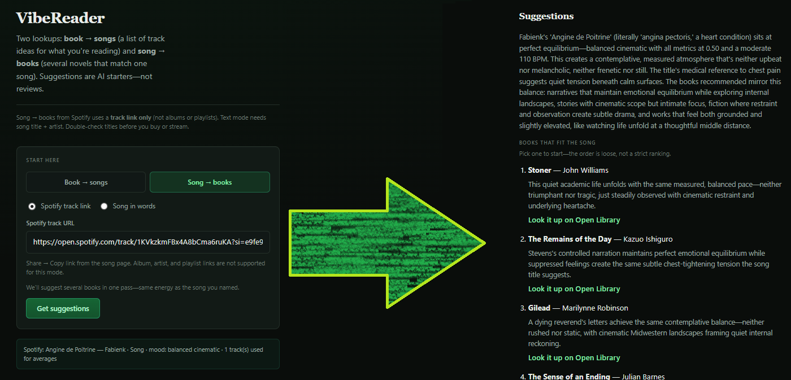

# VibeReader

Book-to-music and music-to-book recommendations powered by Claude.

<!-- SCREENSHOT: Drop a 1400px wide screenshot of the main UI with a result loaded — either book→songs or song→books, whichever looks more complete. Filename: screenshot.png -->



**Live:** [vibereader.fredericlabadie.com](https://vibereader.fredericlabadie.com)

---

## What it is

VibeReader finds the sonic equivalent of a book, or the literary equivalent of a song. Give it a novel and it finds albums and tracks that match its atmosphere, pacing, and emotional register. Give it a song and it surfaces books that live in the same headspace.

It uses Claude to reason about mood, texture, and thematic resonance rather than just genre tags — so *Blood Meridian* doesn't come back with Western soundtracks, and Joy Division doesn't just return bleak fiction.

---

## How it works

**Book → Songs**
Enter a title and author. Claude analyzes the book's tone, period, pacing, and emotional arc, then returns a curated playlist of tracks and artists that share its atmosphere — with reasoning for each recommendation.

**Song → Books**
Enter a track title and artist, or paste a Spotify URL. Claude reads the sonic and lyrical character of the song and returns books that inhabit the same emotional and aesthetic space.

---

## Stack

- **Next.js 14** (App Router) + TypeScript
- **Anthropic claude-sonnet-4-5** — all recommendation calls
- **Spotify Web API** (optional) — pulls audio features and track metadata from URLs
- **Vercel** — deployment

---

## Local development

```bash
git clone https://github.com/fredericlabadie/VibeReader
cd VibeReader
npm install
cp .env.example .env.local
# Fill in env vars
npm run dev
```

**Required:**
```env
ANTHROPIC_API_KEY=
```

**Optional — Spotify track URL support:**
```env
SPOTIFY_CLIENT_ID=
SPOTIFY_CLIENT_SECRET=
```

**Optional — API protection:**
```env
# Set both to the same value. Generate with: openssl rand -base64 32
API_SECRET=
NEXT_PUBLIC_API_SECRET=
```

---

## API

`POST /api/recommendations`

**Book to songs:**
```json
{
  "mode": "book_to_songs",
  "bookTitle": "Beloved",
  "bookAuthor": "Toni Morrison"
}
```

**Song to books (manual):**
```json
{
  "mode": "song_to_books",
  "musicTitle": "Love Will Tear Us Apart",
  "musicArtist": "Joy Division",
  "musicNotes": "post-punk, sparse, grief"
}
```

**Song to books (Spotify URL):**
```json
{
  "mode": "song_to_books",
  "spotifyUrl": "https://open.spotify.com/track/..."
}
```

If `API_SECRET` is set, requests must include `Authorization: Bearer <secret>`.
